# Agentic AI Project - Deployment & User Guide

This guide provides a comprehensive reference for the project structure and step-by-step instructions for local development and GKE deployment.

## 📂 Project Structure Reference

The project is organized into a modular architecture to support scalability and maintainability.

```mermaid
graph TD
    root[agentic_ai_project/]
    
    root --> config[config/]
    root --> agents[agents/]
    root --> tools[tools/]
    root --> workflows[workflows/]
    root --> observability[observability/]
    root --> guardrails[guardrails/]
    root --> data[data/]
    root --> k8s[k8s/]
    root --> tests[tests/]
    root --> docs[docs/]
    
    config --> config_yaml[config.yaml]
    
    agents --> base[base_agent.py]
    agents --> research[research_agent.py]
    agents --> code[code_agent.py]
    agents --> roles[roles.py]
    
    tools --> defs[tool_definitions.py]
    tools --> integrations[api_integrations.py]
    
    workflows --> orch[orchestration.py]
    workflows --> planning[task_planning.py]
    
    observability --> logging[logging.py]
    observability --> metrics[metrics.py]
    observability --> tracing[tracing.py]
    
    guardrails --> safety[safety_checks.py]
    guardrails --> ethics[ethics_policy.py]
    
    k8s --> deploy[deployment.yaml]
    k8s --> service[service.yaml]
    k8s --> secret[secret-template.yaml]

    docs --> user_guide[USER_GUIDE.md]
    docs --> deploy_guide[DEPLOYMENT.md]

    root --> api[api.py]
    root --> docker[Dockerfile]
    root --> req[requirements.txt]
    root --> env[environment.yml]
    root --> readme[README.md]
```




---

## 🚀 Environment Setup Guide

### Option 1: Local Development (Interactive CLI)

1.  **Navigate to the project root:**
    ```bash
    cd agentic_ai_project
    ```

2.  **Create and Activate Virtual Environment:**
    ```bash
    python3 -m venv venv
    source venv/bin/activate
    ```

3.  **Install Dependencies:**
    ```bash
    pip install -r requirements.txt
    ```

4.  **Set Environment Variables:**
    ```bash
    export GOOGLE_API_KEY="your_api_key_here"
    ```

5.  **Run the CLI Orchestrator:**
    From **parent** directory:
    ```bash
    cd ..
    python3 -m agentic_ai_project.workflows.orchestration
    ```
    *Input your task when prompted.*

---

### Option 2: Local API Server (FastAPI)

1.  **Follow steps 1-4 above.**
2.  **Run the API Server:**
    From **parent** directory:
    ```bash
    uvicorn agentic_ai_project.api:app --reload --port 8080
    ```
3.  **Test the API:**
    ```bash
    curl -X POST "http://localhost:8080/agent/run" \
         -H "Content-Type: application/json" \
         -d '{"query": "Create a snake game in python"}'
    ```

---

## ☁️ Google Kubernetes Engine (GKE) Deployment

### 1. Build and Push Container

Ensure you have Google Cloud SDK (`gcloud`) installed and authenticated.

```bash
# Set your Project ID
export PROJECT_ID="your-gcp-project-id"

# Build the image
docker build -t gcr.io/$PROJECT_ID/agentic-ai-app:latest .

# Configure docker auth
gcloud auth configure-docker

# Push to Google Container Registry (or Artifact Registry)
docker push gcr.io/$PROJECT_ID/agentic-ai-app:latest
```

### 2. Prepare Kubernetes Manifests

1.  **Edit `k8s/secret-template.yaml`**:
    *   Replace `YOUR_ACTUAL_API_KEY_HERE` with your real Gemini API key.
    *   **Rename** the file to `secret.yaml` (so you don't commit secrets).

2.  **Edit `k8s/deployment.yaml`**:
    *   Update `image: gcr.io/YOUR_PROJECT_ID/...` with your actual project ID.

### 3. Deploy to GKE

```bash
# Connect to your GKE cluster
gcloud container clusters get-credentials your-cluster-name --zone your-zone

# Apply the Secret
kubectl apply -f k8s/secret.yaml

# Apply the Deployment
kubectl apply -f k8s/deployment.yaml

# Apply the Service (Exposes an External IP)
kubectl apply -f k8s/service.yaml
```

### 4. Verify Deployment
```bash
kubectl get deployments
kubectl get services
```
*Wait for the `EXTERNAL-IP` to be assigned to the service, then you can use that IP to make API calls!*
